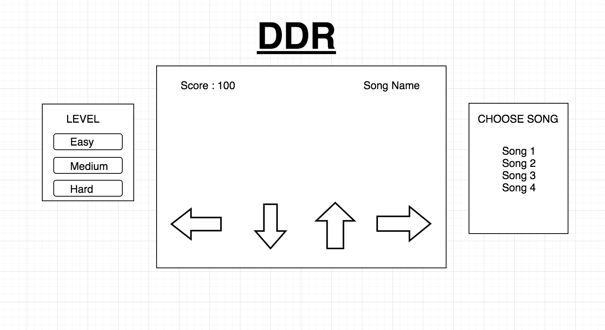

# DDR

### Background
DDR is a mock of Dance Dance Revolution.

### Functionality & MVP
In DDR, user will be able to
- choose level of difficulty: easy, medium, hard
- choose song
- use keyboard to match with the song's dancing steps
- see score as they are playing

In addition, this project will also includes:
- production readme

### Wireframes

### Architecture and Technologies
- Javascript for overall structure and game logic
- HTML5 Canvas for DOM manipulation and rendering
- Webpack to bundle and serve up the various scripts.

### Implementation Timeline
___Day 1:___ Set up all the files and learn about HTML5 Canvas

___Day 2+3:___ Implement all the game logic

___Day 4:___ Do the view and make sure it looks good. 
